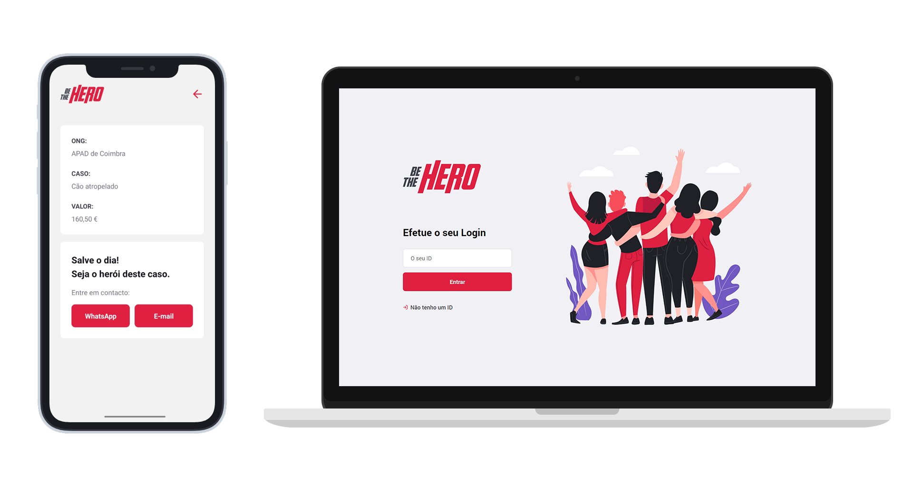

<h1 align="center">
    
</h1>

<h4 align="center">
  🚀 Be The Hero
</h4>

  

  

  <a href="#rocket-tecnologias">Tecnologias</a>&nbsp;&nbsp;&nbsp;|&nbsp;&nbsp;&nbsp;
  <a href="#-projeto">Projeto</a>&nbsp;&nbsp;&nbsp;|&nbsp;&nbsp;&nbsp;
  <a href="#-como-contribuir">Como contribuir</a>&nbsp;&nbsp;&nbsp;|&nbsp;&nbsp;&nbsp;
  <a href="#memo-licença">Licença</a>

 

  

## :rocket: Tecnologias

Este projeto foi desenvolvido com as seguintes tecnologias:

- [Node.js](https://nodejs.org/en/)
- [React](https://reactjs.org)
- [React Native](https://facebook.github.io/react-native/)
- [Expo](https://expo.io/)

## 💻 Projeto

O BeTheHero é um projeto que tem o objetivo de conectar pessoas que desejam fazer contribuições monetárias a ONG's (Organizações não governamentais) que precisam de ajuda.

## 🤔 Como contribuir

- Faça um fork deste repositório;
- Crie um branch com a sua feature: `git checkout -b a-minha-feature`;
- Faça commit das suas alterações: `git commit -m 'feat: A minha nova feature'`;
- Faça push para o seu branch: `git push origin a-minha-feature`.

Depois de o merge da sua pull request ser efetuado, poderá apagar o seu branch.

## :memo: Licença

Este projeto está sob a licença MIT. Leia o arquivo [LICENSE](LICENSE.md) para mais detalhes.

---

Feito com ♥ by Diogo Luz :wave: